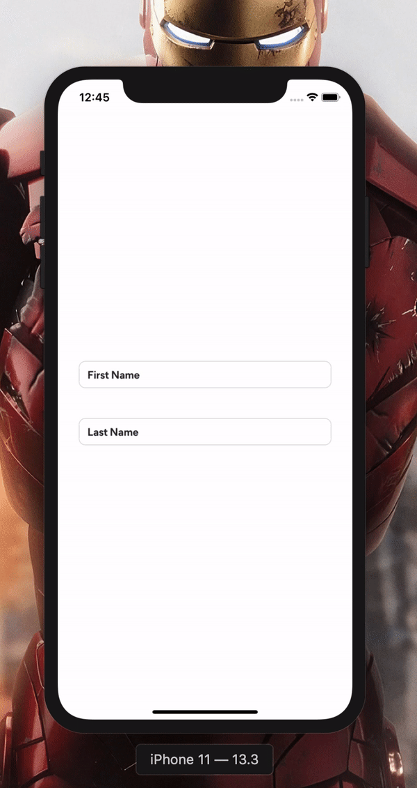

  <h1>Animated Text Input Concept</h1>
  

## :white_check_mark: Todos

- [ ] Create an npm package
- [ ] Refactor FormField and TextInputWrapper

## :v: Contributing

Pull requests are always welcome! Feel free to open a new GitHub issue for any changes that can be made.
